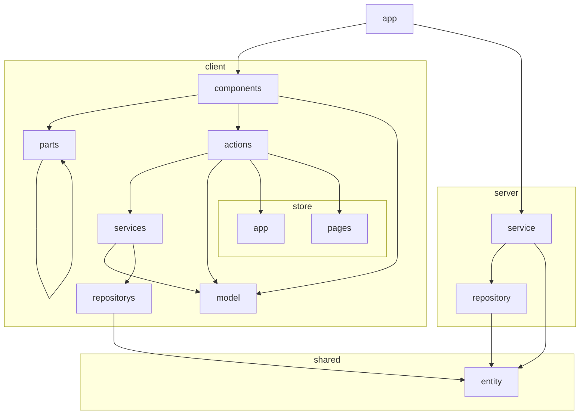

# eslint-plugin-next-architecture

Next.js 向けの opinionated な ESLint plugin です。`app / client / shared / server` 構成を前提に、レイヤー間依存や命名規約を静的に検査します。

## 強制されるディレクトリ構成

この plugin は **固定のディレクトリ構成** を前提にしています。  
つまり、この plugin を使うと次のような責務分割・配置が事実上ルールとして強制されます。



ファイルシステム上の想定構成は以下です。

```txt
app/
client/
  components/
  parts/
  actions/
  model/
  services/
  repositorys/
  store/
    app/
    pages/
shared/
  entity/
server/
  service/
  repository/
```

### 制約の要点

- `app` から `client/components` と `server/service` を呼び出す
- `client/components` は `client/actions` と `client/parts` を参照できる
- `client/components` / `client/actions` / `client/services` は `client/model` を参照できる
- `client/parts` は `client/parts` のみ参照できる
- `client/actions` は `client/services` と `client/store/*` を参照できる
- `client/services` は `client/repositorys` を参照できる
- `client/repositorys` / `server/service` / `server/repository` は `shared/entity` を参照できる
- `server/service` は `server/repository` を参照できる
- `client` と `server` は相互依存できない
- `client/store/app` と `client/store/pages` は相互依存できない
- `client/model` 同士と `shared/entity` 同士は依存できない
- `client/model` と `shared/entity` では型定義のみ許可される
- `client/actions` / `client/components` / `client/store/pages` の一部ルールでは、ページ・コンポーネント境界も強制される
- `client` / `shared` / `server` 直下には、許可されたディレクトリ以外を置けない

このため、単に lint ルールを追加するというより、**Next.js アプリの構造そのものを規約化する plugin** だと考えるのが近いです。

## インストール

```bash
npm install -D eslint eslint-config-next eslint-plugin-next-architecture
```

## 使い方

Flat Config でそのまま使えます。

```js
import nextArchitecture from "eslint-plugin-next-architecture";

export default [
  ...nextArchitecture.configs.recommended,
];
```

`recommended` には以下が含まれます。

- `eslint-config-next/core-web-vitals`
- `eslint-config-next/typescript`
- この plugin の推奨ルール一式
- `**/*.spec.{ts,tsx}` での対象ルール無効化

## ルール一覧

- `next-architecture/no-app-imports`
- `next-architecture/no-same-layer-dependency`
- `next-architecture/no-client-server-cross-dependency`
- `next-architecture/restricted-client-layer-callers`
- `next-architecture/no-client-store-app-pages-cross-dependency`
- `next-architecture/allowed-top-level-directories`
- `next-architecture/layer-file-naming`
- `next-architecture/store-pages-action-page-boundary`
- `next-architecture/actions-components-component-boundary`
- `next-architecture/parts-only-parts-dependency`
- `next-architecture/type-only-layer-definitions`

## 開発用設定例

このリポジトリ自身では、以下のようにローカル import でも利用できます。

```js
import nextArchitecture from "./src/index.js";

export default [
  ...nextArchitecture.configs.recommended,
];
```